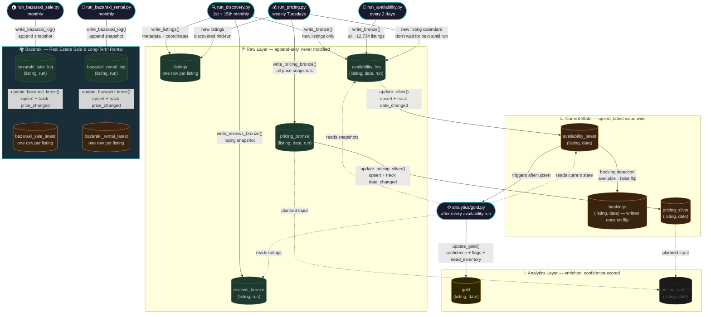

# Data Model

Full reference for all tables in `bnb.duckdb`. See `storage/storage.py` for schema definitions.

- To start the fastapi and power the dashboard use ->  systemctl start bnb-api
---

## Pipeline Overview



---

## Metrics

### Raw Occupancy Rate

The fraction of all scraped calendar days where `available = false`.

```
Raw Occupancy Rate = COUNT(available = false) / COUNT(*) × 100
```

Computed directly from `availability_latest`. Fast and always available, but includes all reasons a date can be unavailable — genuine bookings, owner blocks, seasonal closures, stale listings, and min-stay gaps. Overstates true market demand.

---

### Effective Occupancy Rate (EOR)

The fraction of all calendar days occupied by a genuine guest booking, after stripping calendar noise using the gold layer's confidence scores and flags.

```
Effective Occupancy Rate =
    SUM(booking_confidence)
    / (COUNT(gold-covered dates) − COUNT(dead_inventory = true))
    × 100
```

Requires a JOIN to `gold`. Returns `NULL` for date windows with no gold coverage.

**What gets stripped out vs raw:**

| Source of gap | Mechanism | Typical impact |
|---|---|---|
| Flagged unavailable dates | `booking_confidence = 0` where `flags` contains `seasonal_shutdown`, `stale_listing`, or `min_stay_gap` | ~20pp in shoulder/off season |
| Long-run demotion | Runs of 28+ consecutive unavailable nights score 0.05–0.75 instead of the booking prior — host blocks, LTRs, and calendar-edge artifacts | Large — was the dominant source of inflation pre-2026-05 |
| Confidence discount on genuine bookings | 4–14 night runs score 0.95–1.00; 15–27 night runs score 0.80–0.85 | ~5pp |
| Dead inventory | Dates excluded from denominator entirely (`dead_inventory = true`) — available but unbookable per Airbnb's `bookable` flag (min-nights gaps) | Small |

**Flags that zero out confidence:**

| Flag | What it means |
|---|---|
| `seasonal_shutdown` | Long consecutive unavailable block with no booking pattern — property closed for the season |
| `stale_listing` | Listing calendar stopped updating — host inactive or listing abandoned |
| `min_stay_gap` | Date falls in an unbookable gap due to min-nights rules. Three detection layers: (1) API `bookable=false` on available dates, (2) available gaps shorter than `min_nights` between bookings, (3) host-blocked orphan gaps — short unavailable blocks (`< min_nights`) sandwiched between longer bookings that can't be real bookings |
| `owner_block` | Host manually blocked their own calendar without a guest booking |

**When to use which:**

| Use case | Metric |
|---|---|
| Measuring genuine guest demand | **Effective Occupancy Rate** |
| Comparing markets or time periods | **Effective Occupancy Rate** |
| Checking data freshness / pipeline health | Raw Occupancy Rate |
| Historical periods before gold coverage | Raw Occupancy Rate |

**Empirical decomposition (Cyprus market, Easter week 2026):**

| Metric | Value |
|---|---|
| Raw Occupancy Rate | 92.7% |
| Effective Occupancy Rate | 64.6% |
| Gap | 28.1pp — of which ~20pp from flagged dates, ~8pp from confidence discount |

---

## `listings`

| Attribute | Value |
|-----------|-------|
| **Granularity** | One row per listing |
| **Updated by** | `write_listings()` on every `run_discovery.py` run |
| **Write mode** | Upsert — new listings inserted, existing listings update `last_seen_at` and optional fields |

| Column | Type | Description |
|--------|------|-------------|
| `listing_id` | BIGINT PK | Airbnb listing ID |
| `name` | VARCHAR | Listing title |
| `area` | VARCHAR | Assigned neighbourhood (from bbox assignment in `scraper/areas.py`) |
| `city` | VARCHAR | Top-level city / district (e.g. nicosia, limassol) |
| `latitude` | DOUBLE | GPS latitude |
| `longitude` | DOUBLE | GPS longitude |
| `property_type` | VARCHAR | Airbnb property type string (e.g. "Entire home", "Private room") |
| `bedrooms` | INTEGER | Number of bedrooms |
| `beds` | INTEGER | Number of beds |
| `first_seen` | TIMESTAMP | Timestamp of first discovery run that found this listing |
| `last_seen_at` | TIMESTAMP | Timestamp of most recent discovery run that included this listing — used for delisted detection |

---

## `availability_log` *(was: bronze)*

| Attribute | Value |
|-----------|-------|
| **Granularity** | One row per (listing_id, calendar_date, execution_timestamp) |
| **Updated by** | `write_bronze()` on every `run_availability.py` run |
| **Write mode** | Append-only — rows are never modified after insert |

| Column | Type | Description |
|--------|------|-------------|
| `listing_id` | BIGINT | Airbnb listing ID |
| `area` | VARCHAR | Area label at time of scrape |
| `calendar_date` | DATE | The specific calendar date this row describes |
| `available` | BOOLEAN | Whether the date was available for booking at scrape time |
| `min_nights` | INTEGER | Minimum stay required for this date |
| `max_nights` | INTEGER | Maximum stay allowed |
| `available_for_checkin` | BOOLEAN | Airbnb check-in flag |
| `available_for_checkout` | BOOLEAN | Airbnb check-out flag |
| `bookable` | BOOLEAN | Airbnb bookable flag |
| `price_per_night` | DECIMAL(10,2) | Nightly price at scrape time (often null — use pricing_silver for reliable prices) |
| `execution_timestamp` | TIMESTAMP | When this scrape run executed — groups all rows from the same run |

---

## `availability_latest` *(was: silver)*

| Attribute | Value |
|-----------|-------|
| **Granularity** | One row per (listing_id, calendar_date) — unique |
| **Updated by** | `update_silver()` on every `run_availability.py` run |
| **Write mode** | Upsert — inserts new (listing, date) pairs, updates existing rows on every run |

| Column | Type | Description |
|--------|------|-------------|
| `listing_id` | BIGINT PK | Airbnb listing ID |
| `calendar_date` | DATE PK | The specific calendar date |
| `area` | VARCHAR | Area label |
| `available` | BOOLEAN | Current availability state |
| `min_nights` | INTEGER | Current minimum stay |
| `max_nights` | INTEGER | Current maximum stay |
| `available_for_checkin` | BOOLEAN | Current check-in flag |
| `available_for_checkout` | BOOLEAN | Current check-out flag |
| `bookable` | BOOLEAN | Current bookable flag |
| `price_per_night` | DECIMAL(10,2) | Price at last scrape (often null — use pricing_silver for reliable prices) |
| `last_seen` | TIMESTAMP | Timestamp of the most recent scrape that included this listing |
| `date_changed` | TIMESTAMP | Timestamp of the last scrape where `available` changed — key signal for booking detection |

**Primary use**: occupancy calculations in the dashboard (`COUNT WHERE available = false / COUNT(*)`).

---

## `bookings`

| Attribute | Value |
|-----------|-------|
| **Granularity** | One row per (listing_id, calendar_date) — unique, written once |
| **Updated by** | `update_silver()` booking detection — side-effect of the silver upsert |
| **Write mode** | Insert-on-first-detection — row written the first time a date flips available→unavailable |

| Column | Type | Description |
|--------|------|-------------|
| `listing_id` | BIGINT PK | Airbnb listing ID |
| `calendar_date` | DATE PK | The date that was booked |
| `booked_at` | TIMESTAMP | Timestamp of the scrape run that first detected this date as unavailable |

**Note**: `booked_at` is the detection time, not the actual guest booking time — a date may have been booked days earlier and we only detected it on this scrape.

---

## `gold`

| Attribute | Value |
|-----------|-------|
| **Granularity** | One row per (listing_id, calendar_date) — unique |
| **Updated by** | `analytics/gold.py → update_gold()`, runs after every availability update |
| **Write mode** | Upsert — incremental by default (watermark on `computed_at`), full recompute on first run |

| Column | Type | Description |
|--------|------|-------------|
| `listing_id` | BIGINT PK | Airbnb listing ID |
| `calendar_date` | DATE PK | The specific calendar date |
| `booking_confidence` | DOUBLE | 0.0–1.0 probability that an unavailable date is a real guest booking (vs noise) |
| `dead_inventory` | BOOLEAN | True if date is available but unbookable (guest can't select it due to min-nights rules) — uses Airbnb's `bookable` flag directly, with heuristic fallback |
| `flags` | VARCHAR (JSON) | Sorted JSON array of active flags, e.g. `["owner_block", "stale_listing"]` |
| `flag_details` | VARCHAR (JSON) | Structured metadata per flag — e.g. block length, confidence breakdown |
| `computed_at` | TIMESTAMP | When this row was last computed — used as incremental watermark |
| `stale_listing` | BOOLEAN | True if listing appears inactive/abandoned — calendar never changes, absurd pricing, or 100% available across 4+ scrapes |
| `avg_rating` | DOUBLE | Latest avg rating from reviews_bronze (denormalized for dashboard performance) |
| `review_count` | INTEGER | Latest review count from reviews_bronze (denormalized) |
| `available` | BOOLEAN | Availability state from `availability_latest` (denormalized) |
| `price_per_night` | DECIMAL(10,2) | Price from `pricing_silver` (fallback: `availability_latest.price_per_night`) |
| `area` | VARCHAR | Area label (denormalized from `availability_latest`) |
| `stale_listing` | BOOLEAN | True if listing appears inactive/abandoned |
| `weight_reason` | VARCHAR | Primary reason confidence differs from baseline (first match: stale_listing / seasonal_shutdown / owner_block / min_stay_gap) |

**Booking dynamics** — populated only for dates present in the `bookings` table (NULL for available dates and non-booking-source unavailability):

| Column | Type | Description |
|--------|------|-------------|
| `booking_id` | VARCHAR | Synthetic ID `{listing_id}_{first_date_iso}` grouping consecutive booked dates into a single stay |
| `booking_detected_at` | TIMESTAMP | First scrape that saw this date as unavailable — proxy for "when the booking was made". Bounded by the 2-day scrape cadence (actual reservation event may be earlier) |
| `booking_lead_time_days` | INTEGER | `calendar_date − booked_at.date()` — how far in advance the booking was detected. May be negative if booked retroactively (scrape-cadence noise). Capped below by the 2-day scrape cadence |
| `stay_length_nights` | INTEGER | Length of the contiguous booked block this date belongs to |
| `stay_position` | INTEGER | 1-indexed position of this date within the stay (1 = check-in night, `stay_length_nights` = check-out night) |

**Caveats**:
- A "stay" is detected as consecutive booked dates with no 1-day gap. Adjacent bookings by different guests will be merged into one synthetic booking. Filter by `booking_confidence` or `stale_listing = false` to exclude noise (e.g. multi-month "bookings" on stale calendars are almost certainly host blocks).
- `booking_lead_time_days` is bounded below by our scrape cadence — true lead time may be ≥ this value.

**Run-length context** — populated for every unavailable date (including "orphans" that never appeared in the `bookings` table because we didn't observe the flip). Drives the length-based confidence rubric below.

| Column | Type | Description |
|--------|------|-------------|
| `run_length` | INTEGER | Number of consecutive unavailable nights this date belongs to within the listing's calendar. NULL for available dates |
| `run_ends_at_horizon` | BOOLEAN | True if the run terminates at the listing's furthest scraped date (`MAX(calendar_date)` in `availability_latest` for the listing) — strong signal of calendar-edge dead inventory rather than a real booking |

---

### Booking confidence rubric

`booking_confidence` is computed by [analytics/confidence.py](analytics/confidence.py) in four priority layers. The score answers: **how likely is this unavailable date a real revenue-generating guest booking?**

**P1 — Hard zeros (flags rule out a booking):**
- `available = true` → `0.00`
- `flags` contains `seasonal_shutdown` / `min_stay_gap` / `stale_listing` → `0.00`

**P2 — Long-run heuristics (`run_length ≥ 28`):**
Calendar-edge artifacts and host blocks dominate this regime. Real STR bookings of 28+ nights are rare (LTRs through Airbnb exist but are the exception).

| Conditions | Score | Interpretation |
|---|---:|---|
| `run_ends_at_horizon = true` & no observed flip | `0.05` | dead inventory at scrape boundary |
| `run_ends_at_horizon = false` & no observed flip | `0.15` | host block / LTR with no booking signal |
| observed flip (transition_detected) | `0.75` | likely real long-term booking we caught |

**P3 — Length-based prior (normal-range runs):**

| `run_length` | Base score | Interpretation |
|---:|---:|---|
| 4–14 | `0.95` | classic STR booking window |
| 15–27 | `0.80` | extended stay — slight discount |
| 1–3 | `0.85` | short / single-night booking (`min_stay_gap` already filtered) |

**P4 — Modifiers (additive):**
- `transition_detected = true` → `+0.05` (we caught the flip true→false in our 2-day cadence)
- `owner_block` flag → `−(owner_block_score × 0.8)`

Final score is clamped to `[0.0, 1.0]`.

**Why length matters:** Empirical analysis (May 2026) showed ~58% of dates scoring 0.85 under the old uniform-prior model were in runs of 28+ consecutive unavailable nights — calendar-edge artifacts and host blocks, not bookings. Conversely, ~14% sat in the 4–14 night classic STR window, scored at 0.85 when they should have been ≥0.95. The new rubric splits these cleanly.

**Calendar context** — deterministic per `calendar_date`, populated for every gold row:

| Column | Type | Description |
|--------|------|-------------|
| `day_of_week` | SMALLINT | 0 = Monday … 6 = Sunday |
| `is_weekend` | BOOLEAN | True if Saturday or Sunday |
| `season` | VARCHAR | Cyprus tourism bucket: `peak` (Jun–Sep), `shoulder` (Apr/May/Oct), `off` (Nov–Mar) |
| `is_holiday` | BOOLEAN | True if a Republic of Cyprus public holiday (Greek Cypriot side) |
| `holiday_name` | VARCHAR | Holiday name if `is_holiday`, else NULL. Includes movable feasts (Orthodox Easter, Green Monday, Holy Spirit Monday) |

**Denormalized listing attributes** — joined from `listings` at compute time. Refreshed on every gold update (drift between scrape windows is acceptable for analytics):

| Column | Type | Description |
|--------|------|-------------|
| `property_type` | VARCHAR | e.g. Apartment, Townhouse, Villa |
| `bedrooms` | INTEGER | |
| `beds` | INTEGER | |
| `size_sqm` | INTEGER | From listing detail enrichment; often NULL |
| `is_superhost` | BOOLEAN | From listing detail enrichment |
| `is_guest_fav` | BOOLEAN | From listing detail enrichment |
| `proximity_beach_min` | INTEGER | Walking minutes to beach (when surfaced by Airbnb) |
| `proximity_center_min` | INTEGER | Walking minutes to city centre |

**Amenity flags** — parsed from `listings.amenities` JSON via case-insensitive substring match. All flags default to `FALSE` if a listing has never been enriched. See `analytics/enrichment.py` for the full pattern dictionary.

| Flag | Matches (lowercase substring on amenity title) |
|------|------------------------------------------------|
| `has_pool` | pool (any: private / shared / heated) |
| `has_hot_tub` | hot tub, jacuzzi, sauna |
| `has_sea_view` | sea view, ocean view |
| `has_mountain_view` | mountain view |
| `has_beach_view` | beach view |
| `has_city_view` | city view, city skyline view |
| `has_garden_view` | garden view |
| `has_patio_or_balcony` | patio or balcony (matches "Private patio or balcony" too) |
| `has_backyard` | backyard |
| `has_garden` | garden (excluding "garden view") |
| `has_bbq` | bbq, bbq grill, barbecue |
| `has_outdoor_furniture` | outdoor furniture |
| `has_beach_access` | beach access, beachfront, waterfront |
| `has_crib` | crib |
| `has_high_chair` | high chair |
| `has_pack_n_play` | pack 'n play, travel crib |
| `has_kids_toys` | children's books and toys |
| `is_pet_friendly` | pets allowed |
| `has_workspace` | dedicated workspace |
| `has_fast_wifi` | fast wifi |
| `has_ev_charger` | ev charger |
| `has_free_parking` | free parking on premises |
| `has_gym` | gym |
| `has_exercise_equipment` | exercise equipment |
| `long_term_stays_allowed` | long term stays allowed |

**Flags reference**:

| Flag | Meaning |
|------|---------|
| `stale_listing` | Listing appears frozen — price/availability unchanged vs. market trend |
| `owner_block` | Host blocked their own calendar (unavailability added between scrapes without a booking pattern) |
| `min_stay_gap` | Unbookable gap due to min-nights rules — detected via API `bookable` flag, available-gap heuristic, or host-blocked orphan detection |
| `seasonal_shutdown` | Date falls within a recurring seasonal closure pattern |

**Primary use**: confidence-adjusted occupancy — more accurate than raw `availability_latest` because owner blocks and dead inventory are excluded.

---

## `reviews_bronze`

| Attribute | Value |
|-----------|-------|
| **Granularity** | One row per (listing_id, execution_timestamp) |
| **Updated by** | `write_reviews_bronze()` on every `run_discovery.py` run |
| **Write mode** | Append-only |

| Column | Type | Description |
|--------|------|-------------|
| `listing_id` | BIGINT | Airbnb listing ID |
| `avg_rating` | DOUBLE | Average guest rating at scrape time (1.0–5.0) |
| `review_count` | INTEGER | Total review count at scrape time |
| `execution_timestamp` | TIMESTAMP | When this scrape ran |

---

## `pricing_bronze`

| Attribute | Value |
|-----------|-------|
| **Granularity** | One row per (listing_id, calendar_date, execution_timestamp) |
| **Updated by** | `write_pricing_bronze()` on every `run_pricing.py` run (Tuesdays) |
| **Write mode** | Append-only |

| Column | Type | Description |
|--------|------|-------------|
| `listing_id` | BIGINT | Airbnb listing ID |
| `calendar_date` | DATE | The specific date this price applies to |
| `price_per_night` | DECIMAL(10,2) | Nightly price from a dated tile search |
| `execution_timestamp` | TIMESTAMP | When this pricing run executed |

**Note**: Prices come from dated `search_by_area()` calls (with check_in/check_out), which return the actual nightly rate for that window — more reliable than `availability_log.price_per_night`.

---

## `pricing_silver`

| Attribute | Value |
|-----------|-------|
| **Granularity** | One row per (listing_id, calendar_date) — unique |
| **Updated by** | `update_pricing_silver()` on every `run_pricing.py` run |
| **Write mode** | Upsert |

| Column | Type | Description |
|--------|------|-------------|
| `listing_id` | BIGINT PK | Airbnb listing ID |
| `calendar_date` | DATE PK | The specific date |
| `price_per_night` | DECIMAL(10,2) | Latest known nightly price |
| `last_seen` | TIMESTAMP | Timestamp of the pricing run that last confirmed this price |
| `date_changed` | TIMESTAMP | Timestamp of the last pricing run where the price changed |

**Primary use**: preferred price source for dashboard and analytics — joined to `listings` by `listing_id` to get area-level average prices.

---

## `pricing_gold` 🚧 *not yet implemented*

| Attribute | Value |
|-----------|-------|
| **Granularity** | One row per (listing_id, calendar_date) — unique |
| **Updated by** | *planned: `analytics/pricing_gold.py`*, runs after every `run_pricing.py` |
| **Write mode** | Upsert |

| Column | Type | Description |
|--------|------|-------------|
| `listing_id` | BIGINT PK | Airbnb listing ID |
| `calendar_date` | DATE PK | The specific date |
| `price_per_night` | DECIMAL(10,2) | Latest known nightly price (from pricing_silver) |
| `price_first_seen` | DECIMAL(10,2) | Price when this date was first observed |
| `price_changes` | INTEGER | Number of times price changed across pricing runs |
| `days_to_checkin` | INTEGER | Days between the pricing run and calendar_date — measures how far in advance prices were captured |
| `last_changed_at` | TIMESTAMP | Timestamp of the pricing run where price last changed |
| `computed_at` | TIMESTAMP | When this row was last computed |

**Planned use**: price dynamics analysis — how prices change as check-in approaches, lead-time pricing patterns, area-level yield management insights.

**Depends on**: `pricing_bronze` (history of all price snapshots) + `pricing_silver` (latest state) + `listings` (area assignment).

---

## Bazaraki — Real Estate Sale & Long-Term Rental

Source: [bazaraki.com](https://www.bazaraki.com) — Cyprus property classifieds (apartments + houses, island-wide).
Scripts: `run_bazaraki_sale.py` and `run_bazaraki_rental.py` — run monthly.

---

## `bazaraki_sale_log`

| Attribute | Value |
|-----------|-------|
| **Granularity** | One row per (listing_id, execution_timestamp) |
| **Updated by** | `write_bazaraki_log()` on every `run_bazaraki_sale.py` run |
| **Write mode** | Append-only |

| Column | Type | Description |
|--------|------|-------------|
| `listing_id` | BIGINT | Bazaraki listing ID |
| `title` | VARCHAR | Full listing title (e.g. "3-bedroom apartment in Limassol") |
| `price` | DECIMAL(12,2) | Asking price in EUR at scrape time |
| `latitude` | DOUBLE | GPS latitude (from geometry API) |
| `longitude` | DOUBLE | GPS longitude |
| `bedrooms` | INTEGER | Bedroom count parsed from title |
| `property_type` | VARCHAR | Property type parsed from title (apartment, house, villa, etc.) |
| `url` | VARCHAR | Relative URL path on bazaraki.com |
| `execution_timestamp` | TIMESTAMP | When this scrape run executed |

---

## `bazaraki_sale_latest`

| Attribute | Value |
|-----------|-------|
| **Granularity** | One row per listing_id — unique |
| **Updated by** | `update_bazaraki_latest()` on every `run_bazaraki_sale.py` run |
| **Write mode** | Upsert — new listings inserted, existing listings updated |

| Column | Type | Description |
|--------|------|-------------|
| `listing_id` | BIGINT PK | Bazaraki listing ID |
| `title` | VARCHAR | Latest listing title |
| `price` | DECIMAL(12,2) | Latest asking price in EUR |
| `latitude` | DOUBLE | GPS latitude |
| `longitude` | DOUBLE | GPS longitude |
| `bedrooms` | INTEGER | Bedroom count |
| `property_type` | VARCHAR | Property type |
| `url` | VARCHAR | Relative URL path |
| `first_seen` | TIMESTAMP | Timestamp of first scrape run that found this listing |
| `last_seen` | TIMESTAMP | Timestamp of most recent scrape run |
| `price_changed` | TIMESTAMP | Timestamp of the last scrape run where price changed |

**Primary use**: current market snapshot of for-sale properties — price distribution, supply by area, price-per-bedroom analysis.

---

## `bazaraki_rental_log`

| Attribute | Value |
|-----------|-------|
| **Granularity** | One row per (listing_id, execution_timestamp) |
| **Updated by** | `write_bazaraki_log()` on every `run_bazaraki_rental.py` run |
| **Write mode** | Append-only |

| Column | Type | Description |
|--------|------|-------------|
| `listing_id` | BIGINT | Bazaraki listing ID |
| `title` | VARCHAR | Full listing title |
| `monthly_rent` | DECIMAL(12,2) | Monthly rent in EUR at scrape time |
| `latitude` | DOUBLE | GPS latitude |
| `longitude` | DOUBLE | GPS longitude |
| `bedrooms` | INTEGER | Bedroom count parsed from title |
| `property_type` | VARCHAR | Property type parsed from title |
| `url` | VARCHAR | Relative URL path on bazaraki.com |
| `execution_timestamp` | TIMESTAMP | When this scrape run executed |

---

## `bazaraki_rental_latest`

| Attribute | Value |
|-----------|-------|
| **Granularity** | One row per listing_id — unique |
| **Updated by** | `update_bazaraki_latest()` on every `run_bazaraki_rental.py` run |
| **Write mode** | Upsert — new listings inserted, existing listings updated |

| Column | Type | Description |
|--------|------|-------------|
| `listing_id` | BIGINT PK | Bazaraki listing ID |
| `title` | VARCHAR | Latest listing title |
| `monthly_rent` | DECIMAL(12,2) | Latest monthly rent in EUR |
| `latitude` | DOUBLE | GPS latitude |
| `longitude` | DOUBLE | GPS longitude |
| `bedrooms` | INTEGER | Bedroom count |
| `property_type` | VARCHAR | Property type |
| `url` | VARCHAR | Relative URL path |
| `first_seen` | TIMESTAMP | Timestamp of first scrape run that found this listing |
| `last_seen` | TIMESTAMP | Timestamp of most recent scrape run |
| `price_changed` | TIMESTAMP | Timestamp of the last scrape run where monthly_rent changed |

**Primary use**: current long-term rental market — monthly rent by area and bedroom count, rental yield calculations (cross-referenced with `bazaraki_sale_latest`).
